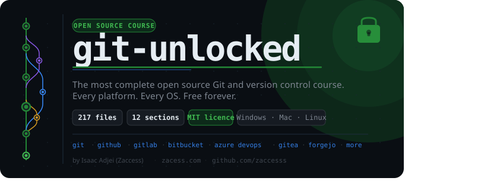

# git-unlocked

> The most complete open source Git and version control course available. Free forever. MIT licensed.

git-unlocked takes you from absolute zero to professional-level Git across every major platform: GitHub, GitLab, Bitbucket, Azure DevOps, Gitea, Forgejo and Codeberg. Every file covers Windows, Mac and Linux side by side. Nothing assumed. Nothing skipped.

**217 files. 12 sections. All free.**

---

## Start here

New to Git? Start at the beginning:

1. [00-welcome/](00-welcome/README.md) - what this course is
2. [What is version control?](01-introduction/04-version-control-concepts.md)
3. [How to use this course](01-introduction/02-how-to-use-this-course.md)
4. [Setting up your environment](01-introduction/03-setting-up.md)

Want to make your first open source contribution right now? Go to [11-first-contribution/](11-first-contribution/README.md). It takes less than ten minutes.

---

## Course contents

| #   | Section                                      | Files | What is inside                                                 |
| --- | -------------------------------------------- | ----- | -------------------------------------------------------------- |
| 00  | [welcome](00-welcome/)                       | 1     | Introduction to the course                                     |
| 01  | [introduction](01-introduction/)             | 3     | Concepts, setup, how to navigate                               |
| 02  | [git](02-git/)                               | 29    | Everything about Git from `git init` to internals              |
| 03  | [github](03-github/)                         | 28    | Full GitHub platform coverage                                  |
| 04  | [gitlab](04-gitlab/)                         | 16    | Full GitLab platform coverage                                  |
| 05  | [other-platforms](05-other-platforms/)       | 62    | Bitbucket, Azure DevOps, Gitea, Forgejo, Codeberg              |
| 06  | [ides-and-editors](06-ides-and-editors/)     | 14    | VS Code, JetBrains, Neovim, Cursor, Zed and more               |
| 07  | [terminal](07-terminal/)                     | 14    | Shell setup, lazygit, delta, fzf, bat, tig and more            |
| 08  | [real-world](08-real-world/)                 | 8     | Open source contribution, GitOps, monorepos, disaster recovery |
| 09  | [reference](09-reference/)                   | 4     | Cheatsheet, glossary, common mistakes, security                |
| 10  | [resources](10-resources/)                   | 1     | 120+ curated books, videos, tools and communities              |
| 11  | [first-contribution](11-first-contribution/) | 2     | Make your first open source PR here                            |

Each section has an overview file (`00-*.md`) with a full table of contents and reading order for that section.

---

## Difficulty levels

- 🟢 Beginner - no prior experience needed
- 🟡 Intermediate - comfortable with basic Git
- 🔴 Advanced - production depth, internals, edge cases

OS commands are labelled 🪟 Windows, 🍎 Mac and 🐧 Linux. Identical commands appear once without labels.

---

## Make your first contribution

The [11-first-contribution/](11-first-contribution/README.md) folder is a safe sandbox. Add your name to the contributors list and open a pull request. Less than ten minutes. Real GitHub workflow.

---

## Contributing

Read [CONTRIBUTING.md](CONTRIBUTING.md) first, then open a pull request. Everyone who contributes is listed in [HALL_OF_FAME.md](HALL_OF_FAME.md). Please read the [Code of Conduct](CODE_OF_CONDUCT.md) before participating.

---

## Licence

[MIT Licence](LICENSE). Use, share, adapt and build on it - just give credit.

---

## Contributors

  

---

 

Made with 🔓 by [Isaac Adjei](https://isaacadjei.me)

**Access Granted. Success Unlocked.**

 

If this course helped you, please star the repository. It helps others find it.

 

 

## Contact and Support

Open an [issue](https://github.com/zaccesss/git-unlocked/issues) in this repository for questions or bugs.

You can also reach me directly at [contact@isaacadjei.me](mailto:contact@isaacadjei.me) or via my [website contact page](https://isaacadjei.me/contact).

  

